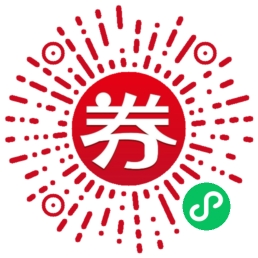

## 美团，饿了么联盟
这俩都是外卖平台的联盟，简单的说就是可以在这里拿到一个链接，别人用这个链接下单了，你就可以拿到一定比例的佣金

## 拼多多券

一样道理，点你链接下单，一样可以获取一定比例佣金

## 效果展示

## 微信小程序
微信小程序大家应该都很熟悉了，基本每天都出现在手机，可能你没注意过，但是只要你打开微信，各种服务都是用微信小程序实现

## 具体步骤
首先，注册好美团联盟和淘宝联盟（淘宝联盟就是饿了么联盟）
美团联盟：美团联盟

淘宝联盟： 阿里妈妈

首先在上面两个链接里注册号两个账号，美团联盟里拿到美团外卖的推广链接，淘宝联盟里拿到饿了么外卖的推广链接，

美团联盟要用企业信息去注册，也就是说你需要有一个公司

淘宝联盟用个人信息就可以

## 注册微信小程序
微信公众平台：微信公众平台

注册一个微信小程序，个人资质就可以，只需要一个邮箱号

## 开发
代码非常的简单，就是列表，列表里面是跳转链接，点哪领哪个券

小程序名：早晚券
具体功能可以用微信扫码看看

## 微信云开发
云开发文档：微信开放文档

开发者可以使用云开发开发微信小程序、小游戏，无需搭建服务器，即可使用云端能力。
云开发为开发者提供完整的原生云端支持和微信服务支持，弱化后端和运维概念，无需搭建服务器，使用平台提供的 API 进行核心业务开发，即可实现快速上线和迭代，同时这一能力，同开发者已经使用的云服务相互兼容，并不互斥。
简单的说就是用了这个就不需要去搞个服务器了

直接在微信开发者工具的可视化数据库里面添加就完事，简单的一批

## 最后

如果你觉得这些代码还是太复杂了，那么你可以直接联系我q :`930277706` , 有问题我能尽量帮助, 也可以选择让我直接给你部署上线(有偿, 时间成本很高的)

## 常见问题

* 怎么获取饿了么和美团的推广链接
  
  美团联盟：https://union.meituan.com/

  饿了么、双十一：https://pub.alimama.com/

