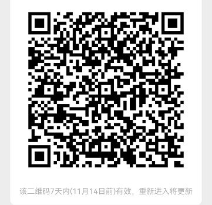

## 美团，饿了么联盟
这俩都是外卖平台的联盟，简单的说就是可以在这里拿到一个链接，别人用这个链接下单了，你就可以拿到一定比例的佣金

## 拼多多券

一样道理，点你链接下单，一样可以获取一定比例佣金

## 效果展示

## 进群交流
qq群 

微信群

## 微信小程序
微信小程序大家应该都很熟悉了，基本每天都出现在手机，可能你没注意过，但是只要你打开微信，各种服务都是用微信小程序实现

## 具体步骤
首先，注册好美团联盟和淘宝联盟（淘宝联盟就是饿了么联盟）
美团联盟：美团联盟

淘宝联盟： 阿里妈妈

拼多多：多多进宝
首先在上面两个链接里注册号两个账号，美团联盟里拿到美团外卖的推广链接，淘宝联盟里拿到饿了么外卖的推广链接，

美团联盟要用企业信息去注册，也就是说你需要有一个公司

淘宝联盟用个人信息就可以

多多进宝用个人信息就可以

## 注册微信小程序
微信公众平台：微信公众平台

注册一个微信小程序，个人资质就可以，只需要一个邮箱号

## 开发
代码非常的简单，就是列表，列表里面是跳转链接，点哪领哪个券

小程序名：早晚券
具体功能可以用微信扫码看看

## 最后

如果你觉得这些代码还是太复杂了，那么你可以直接加群, 有问题我能尽量帮助, 也可以选择让我直接给你部署上线(有偿, 时间成本很高的)

## 常见问题

* 怎么获取饿了么和美团的推广链接
  
  美团联盟：https://union.meituan.com/

  饿了么、双十一：https://pub.alimama.com/

